# Test 1

<table align="center">
  <tr>
    <td align="center">
      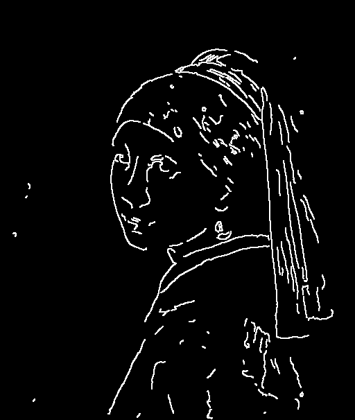
    </td>
    <td align="center">
      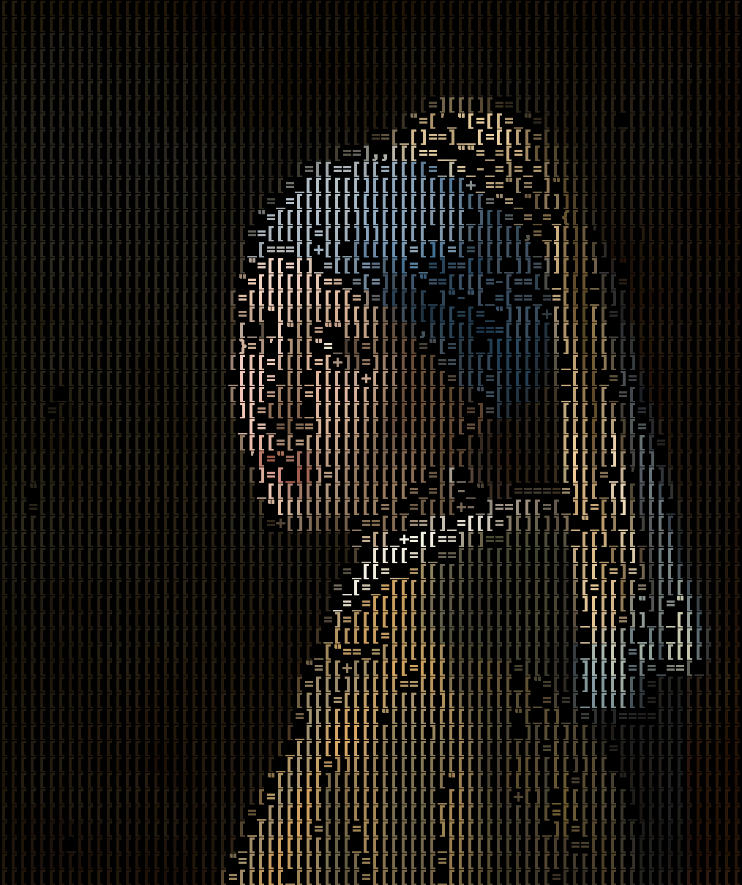
    </td>
  </tr>
</table>

| Test                 | Property |
|----------------------|----------|
| Algorithm            | Trace    |
| Color Image          | ✅        |
| Invert Contour Color | ✅        |
| Invert Image Color   | ❌        |
| ~~Save ASCII~~       | ❌        |

```commandline
python contour.py ^
--image_path ../../resource/imgs/girl_with_pearl_earring.jpg ^
--canny1_min 160 --canny1_max 201 --canny1_step 20 ^
--canny2_min 240 --canny2_max 281 --canny2_step 20 ^
--dilate_iter 1 --erode_iter 0 --gb_sigmaX 0 --gb_size 5 ^
--contrast_factor 4 --contrast_window_size 8 ^
--invert_color
```

```commandline
python edge_trace.py ^
--image_path ./contour/contour_180_260.png ^
--resize_factor 2 ^
--palette_path ../../resource/palette_files/palette_chars_consolab_fast.json ^
--match_method slow ^
--color_option original ^
--original_image_path ../../resource/imgs/girl_with_pearl_earring.jpg
```

---

# Test 2

<table align="center">
  <tr>
    <td align="center">
      
    </td>
    <td align="center">
      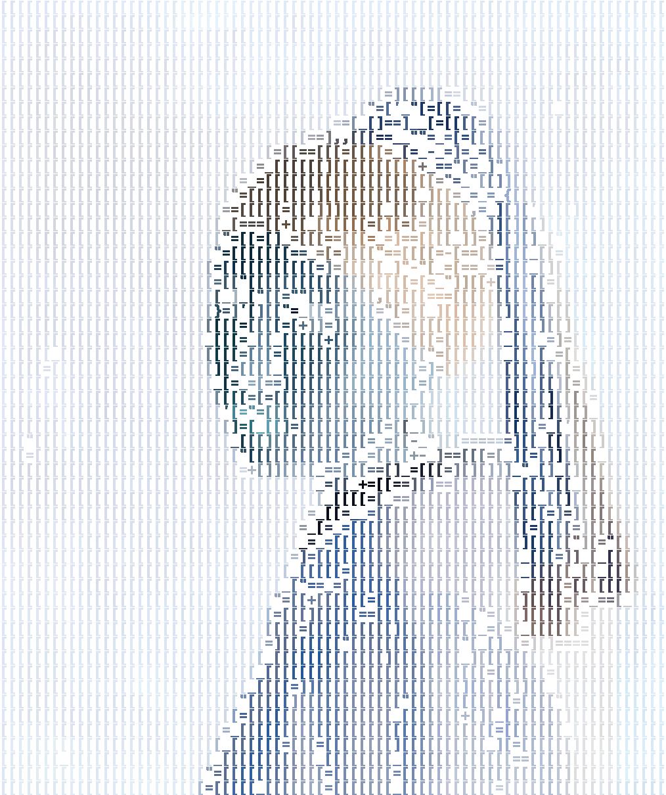
    </td>
  </tr>
</table>

| Test                 | Property |
|----------------------|----------|
| Algorithm            | Trace    |
| Color Image          | ✅        |
| Invert Contour Color | ✅        |
| Invert Image Color   | ✅        |
| ~~Save ASCII~~       | ❌        |

```commandline
python contour.py ^
--image_path ../../resource/imgs/girl_with_pearl_earring.jpg ^
--canny1_min 160 --canny1_max 201 --canny1_step 20 ^
--canny2_min 240 --canny2_max 281 --canny2_step 20 ^
--dilate_iter 1 --erode_iter 0 --gb_sigmaX 0 --gb_size 5 ^
--contrast_factor 4 --contrast_window_size 8 ^
--invert_color
```

```commandline
python edge_trace.py ^
--image_path ./contour/contour_180_260.png ^
--resize_factor 1 ^
--palette_path ../../resource/palette_files/palette_chars_consolab_fast.json ^
--match_method slow ^
--color_option original ^
--original_image_path ../../resource/imgs/girl_with_pearl_earring.jpg ^
--invert_color
```

---

# Test 3

<p align="center">
    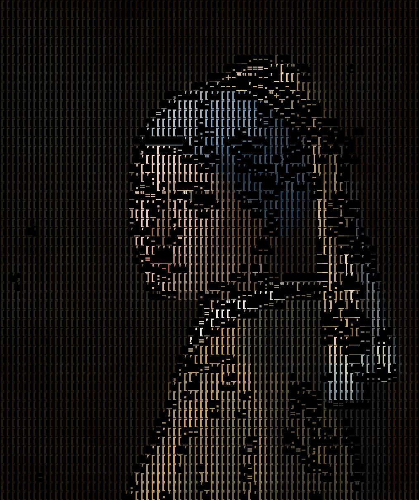
</p>

| Test               | Property   |
|--------------------|------------|
| Algorithm          | Trace-Join |
| Color Image        | ✅          |
| Invert Image Color | ❌          |
| ~~Save ASCII~~     | ❌          |

```commandline
python joined_trace.py ^
--image_path ../../resource/imgs/girl_with_pearl_earring.jpg ^
--canny1 180 ^
--canny2 260 ^
--gb_size 5 ^
--gb_sigmaX 0 ^
--kernel_size 2 ^
--dilate_iter 1 ^
--erode_iter 0 ^
--contrast_factor 4 ^
--contrast_window_size 8 ^
--resize_factor 2 ^
--resize_method nearest_neighbor ^
--match_method slow ^
--palette_path ../../resource/palette_files/palette_chars_consolab_fast.json ^
--color_option original
```

---

# Test 4

<p align="center">
    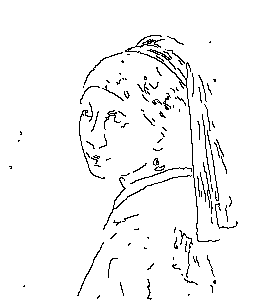
</p>

```text
                                       
                                       
                                       
                     __,.--._   '      
                  _.:"_.'___'          
               _''''' ''-'.'._         
             _-'  .     -_-__'_'       
            ''___'.' .'_.  '.__._'     
            _''''-_._''-'___'-'_''     
            ''_   ''  '''-_''. '_      
            .'_'_-'.  ._'.'''' ..      
            ''.''''-' '''_   -'''-     
  _'        ._' .       _-   _''._     
            ''--'      '''   _ '''_    
            '.--.'    __.    ''_-_-    
 '           '_'   '_-''=-----_'..'-   
              ''' -'.-'_..-'''_._'     
                  _'_-''      ._-.'    
                 __''         ''|'__'  
                _'''_.        _ '''-   
                .'-''_     _  . ''__.  
                '.' ''''   _-_-   _    
               _'  '' .    ._.'''''    
              _' .'       ''''_ _      
             _' _'    '-  '.'''''_     
            _'  ' _   '_    '__  _     
   '        .     '_  '_      ' ''     
```

| Test                   | Property |
|------------------------|----------|
| Algorithm              | Trace    |
| ~~Color Image~~        | ✅        |
| Invert Contour Color   | ❌        |
| ~~Invert Image Color~~ | ❌        |
| Save ASCII             | ✅        |


```commandline
python contour.py ^
--image_path ../../resource/imgs/girl_with_pearl_earring.jpg ^
--canny1_min 160 --canny1_max 201 --canny1_step 20 ^
--canny2_min 240 --canny2_max 281 --canny2_step 20 ^
--dilate_iter 1 --erode_iter 0 --gb_sigmaX 0 --gb_size 5 ^
--contrast_factor 4 --contrast_window_size 8
```

```commandline
python edge_trace.py ^
--image_path ./contour/contour_180_260.png ^
--resize_factor 1 ^
--palette_path ../../resource/palette_files/palette_chars_consolab_fast.json ^
--match_method slow ^
--color_option original ^
--original_image_path ../../resource/imgs/girl_with_pearl_earring.jpg ^
--save_ascii
```

---

# Test 5

<p align="center">
    
</p>

```text
[[[[[[[[[[[[[[[[[[[[[[[[[[[[[[[[[[[[[[[
[[[[[[[[[[[[[[[[[[[[[[[[[[[[[[[[[[[[[[[
[[[[[[[[[[[[[[[[[[[[[[[[[[[[[[[[[[[[[[[
[[[[[[[[[[[[[[[[[[[[[="-=]][=[[[[[[[[[[
[[[[[[[[[[[[[[[[[[=[]==_==][=[[[[[[[[[[
[[[[[[[[[[[[[[[=]=[][[==_=_===[[[[[[[[[
[[[[[[[[[[[[[=[[[[[[[[[[[[]+=[[[[[[[[[[
[[[[[[[[[[[[[]==[[[=[====[[=][[=]][[[[[
[[[[[[[[[[[[=][[=[="[[+]=[=+=][[[[[[[[[
[[[[[[[[[[[[=[][[[[][[=[_[==[][][[[[[[[
[[[[[[[[[[[[[_]][_[][[=[[][[[=[=][[[[[[
[[[[[[[[[[[[][[[][=][[[=[=[[[[=[=][[[[[
[[[][[[[[[[[===[][[[[[[[=][[[[[[][[[[[[
[[[[[[[[[[[[[=[[][[[[[[[=][[[[[[[[][[[[
[[[[[[[[[[[[[=[][[[[[[[["[[[[[[=]][[[[[
[[[[[[[[[[[[[[==[[[[[[=[-_][[[[[=][][[[
[[[[[[[[[[[[[[=]][[==[[==[[===]]+[[[[[[
[[[[[[[[[[[[[[[[[[=]=[==[[[[[[]+=[[[[[[
[[[[[[[[[[[[[[[[[[=][[[[[[[[[[====[=[[[
[[[[[[[[[[[[[[[[[][[==[[[[[[[[[[=[]][[[
[[[[[[[[[[[[[[[[[[]=[=[[[[[=[[[[[[==[[[
[[[[[[[[[[[[[[[[[[[[[=[[[[[=]=[[[[[[[[[
[[[[[[[[[[[[[[[[[[[[][=[[[[_][====[[[[[
[[[[[[[[[[[[[[[=[=][[[[[[[[[[]=[][[[[[[
[[[[[[[[[[[[[[][[[[[[[[[[[[][]=[[[[[[[[
[[[[[[[[[[[[[][[[[=[[[[[[[[[]==[[=[[[[[
[[[[[[[[[[[[[[[[[[[[[[[][[[[[[=[[[[[[[[
```

| Test                   | Property |
|------------------------|----------|
| Algorithm              | Trace    |
| ~~Color Image~~        | ✅        |
| Invert Contour Color   | ✅        |
| ~~Invert Image Color~~ | ❌        |
| Save ASCII             | ✅        |

```commandline
python contour.py ^
--image_path ../../resource/imgs/girl_with_pearl_earring.jpg ^
--canny1_min 160 --canny1_max 201 --canny1_step 20 ^
--canny2_min 240 --canny2_max 281 --canny2_step 20 ^
--dilate_iter 1 --erode_iter 0 --gb_sigmaX 0 --gb_size 5 ^
--contrast_factor 4 --contrast_window_size 8 ^
--invert_color
```

```commandline
python edge_trace.py ^
--image_path ./contour/contour_180_260.png ^
--resize_factor 1 ^
--palette_path ../../resource/palette_files/palette_chars_consolab_fast.json ^
--match_method slow ^
--color_option original ^
--original_image_path ../../resource/imgs/girl_with_pearl_earring.jpg ^
--save_ascii
```

---

# Test 6

<p align="center">
    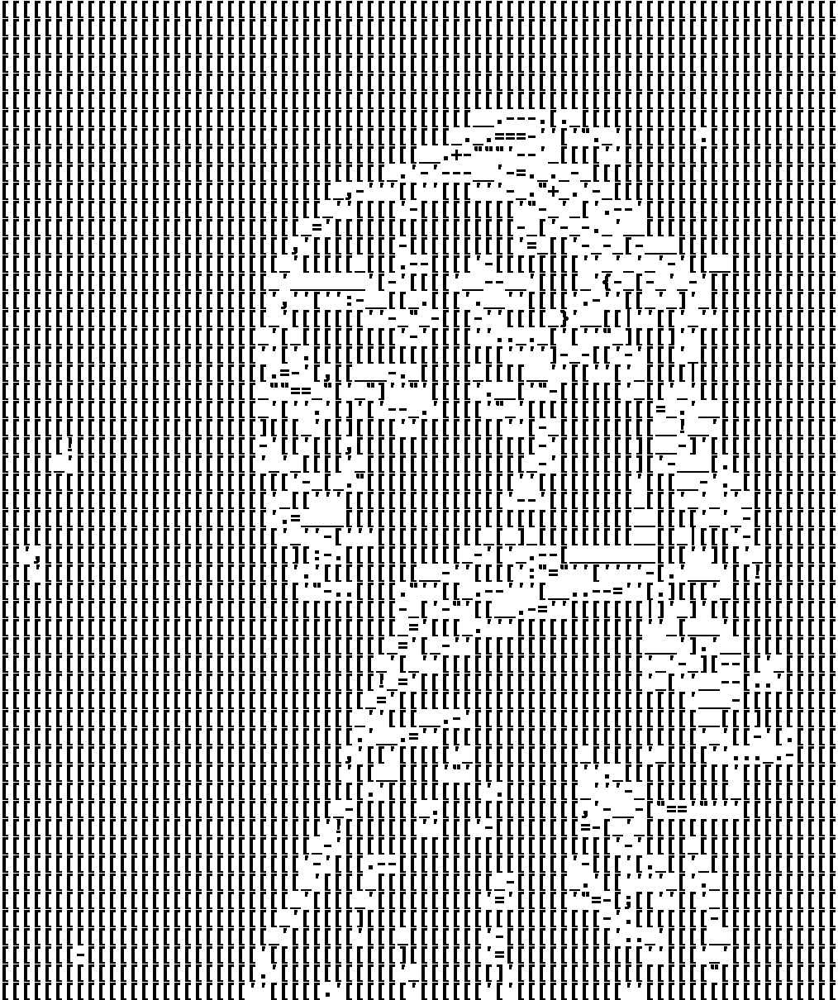
</p>

| Test               | Property   |
|--------------------|------------|
| Algorithm          | Trace-Join |
| Color Image        | ❌          |
| Invert Image Color | ❌          |
| ~~Save ASCII~~     | ❌          |

```commandline
python joined_trace.py ^
--image_path ../../resource/imgs/girl_with_pearl_earring.jpg ^
--canny1 180 ^
--canny2 260 ^
--gb_size 5 ^
--gb_sigmaX 0 ^
--kernel_size 2 ^
--dilate_iter 1 ^
--erode_iter 0 ^
--contrast_factor 4 ^
--contrast_window_size 8 ^
--resize_factor 2 ^
--resize_method nearest_neighbor ^
--match_method slow ^
--palette_path ../../resource/palette_files/palette_chars_consolab_fast.json
```

---

# Test 7

<table align="center">
  <tr>
    <td align="center">
      
    </td>
    <td align="center">
      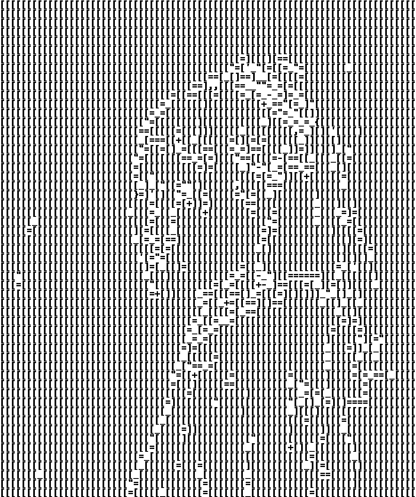
    </td>
  </tr>
</table>

| Test                 | Property |
|----------------------|----------|
| Algorithm            | Trace    |
| Color Image          | ❌        |
| Invert Contour Color | ✅        |
| Invert Image Color   | ❌        |
| ~~Save ASCII~~       | ❌        |

```commandline
python contour.py ^
--image_path ../../resource/imgs/girl_with_pearl_earring.jpg ^
--canny1_min 160 --canny1_max 201 --canny1_step 20 ^
--canny2_min 240 --canny2_max 281 --canny2_step 20 ^
--dilate_iter 1 --erode_iter 0 --gb_sigmaX 0 --gb_size 5 ^
--contrast_factor 4 --contrast_window_size 8 ^
--invert_color
```

```commandline
python edge_trace.py ^
--image_path ./contour/contour_180_260.png ^
--resize_factor 2 ^
--palette_path ../../resource/palette_files/palette_chars_consolab_fast.json ^
--match_method slow ^
--original_image_path ../../resource/imgs/girl_with_pearl_earring.jpg
```

---

# Test 8

<table align="center">
  <tr>
    <td align="center">
      
    </td>
    <td align="center">
      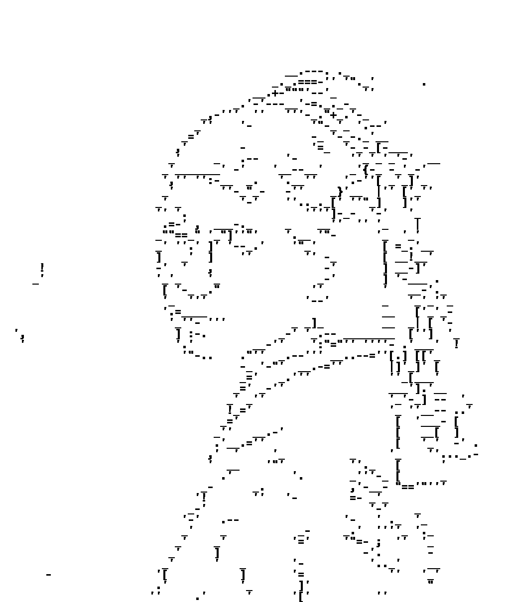
    </td>
  </tr>
</table>

| Test                 | Property |
|----------------------|----------|
| Algorithm            | Trace    |
| Color Image          | ❌        |
| Invert Contour Color | ❌        |
| Invert Image Color   | ❌        |
| ~~Save ASCII~~       | ❌        |

```commandline
python contour.py ^
--image_path ../../resource/imgs/girl_with_pearl_earring.jpg ^
--canny1_min 160 --canny1_max 201 --canny1_step 20 ^
--canny2_min 240 --canny2_max 281 --canny2_step 20 ^
--dilate_iter 1 --erode_iter 0 --gb_sigmaX 0 --gb_size 5 ^
--contrast_factor 4 --contrast_window_size 8
```

```commandline
python edge_trace.py ^
--image_path ./contour/contour_180_260.png ^
--resize_factor 2 ^
--palette_path ../../resource/palette_files/palette_chars_consolab_fast.json ^
--match_method slow ^
--original_image_path ../../resource/imgs/girl_with_pearl_earring.jpg
```

---

# Test 9

<table align="center">
  <tr>
    <td align="center">
      
    </td>
    <td align="center">
      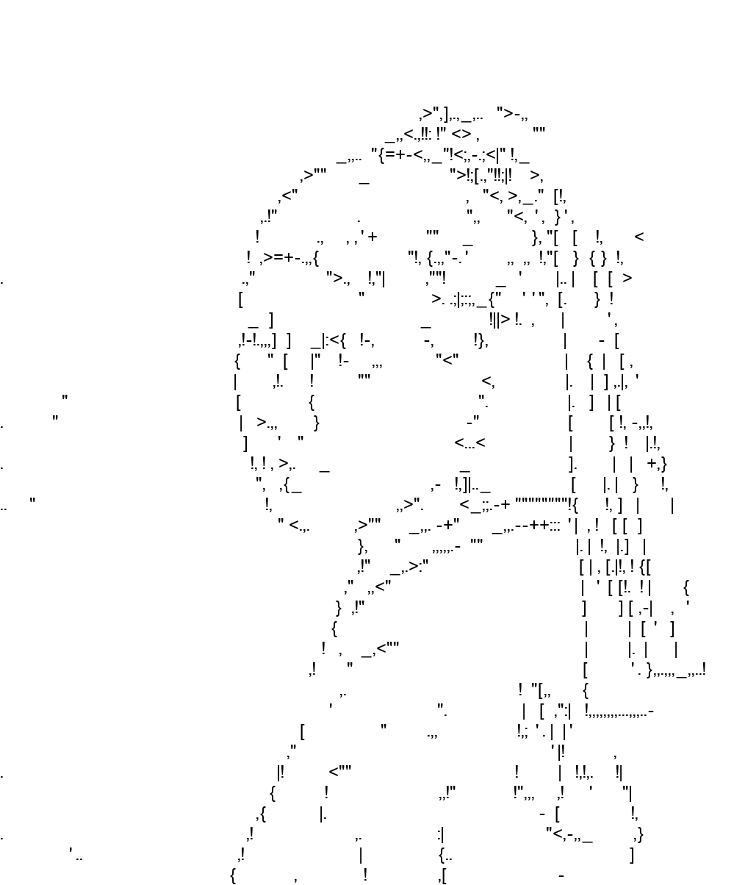
    </td>
  </tr>
</table>

```commandline
python contour.py ^
--image_path ../../resource/imgs/girl_with_pearl_earring.jpg ^
--canny1_min 160 --canny1_max 201 --canny1_step 20 ^
--canny2_min 240 --canny2_max 281 --canny2_step 20 ^
--dilate_iter 1 --erode_iter 0 --gb_sigmaX 0 --gb_size 5 ^
--contrast_factor 4 --contrast_window_size 8
```

```commandline
python edge_trace.py ^
--image_path ./contour/contour_180_260.png ^
--resize_factor 2 ^
--palette_path ../../resource/palette_files/palette_chars_nonfix_arial_fast.json ^
--match_method slow ^
--original_image_path ../../resource/imgs/girl_with_pearl_earring.jpg ^
--antialiasing
```

---

# Test 10

<table align="center">
  <tr>
    <td align="center">
      
    </td>
    <td align="center">
      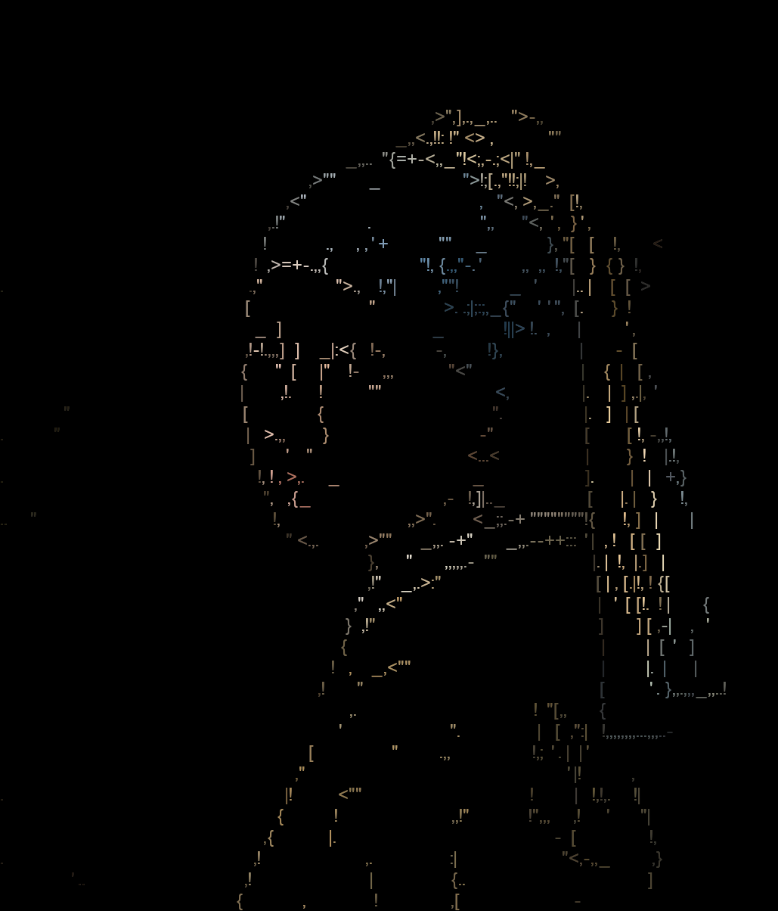
    </td>
  </tr>
</table>

```commandline
python contour.py ^
--image_path ../../resource/imgs/girl_with_pearl_earring.jpg ^
--canny1_min 160 --canny1_max 201 --canny1_step 20 ^
--canny2_min 240 --canny2_max 281 --canny2_step 20 ^
--dilate_iter 1 --erode_iter 0 --gb_sigmaX 0 --gb_size 5 ^
--contrast_factor 4 --contrast_window_size 8
```

```commandline
python edge_trace.py ^
--image_path ./contour/contour_180_260.png ^
--resize_factor 2 ^
--palette_path ../../resource/palette_files/palette_chars_nonfix_arial_fast.json ^
--match_method slow ^
--original_image_path ../../resource/imgs/girl_with_pearl_earring.jpg ^
--antialiasing ^
--color_option original
```

---

# Test 11

<table align="center">
  <tr>
    <td align="center">
      
    </td>
    <td align="center">
      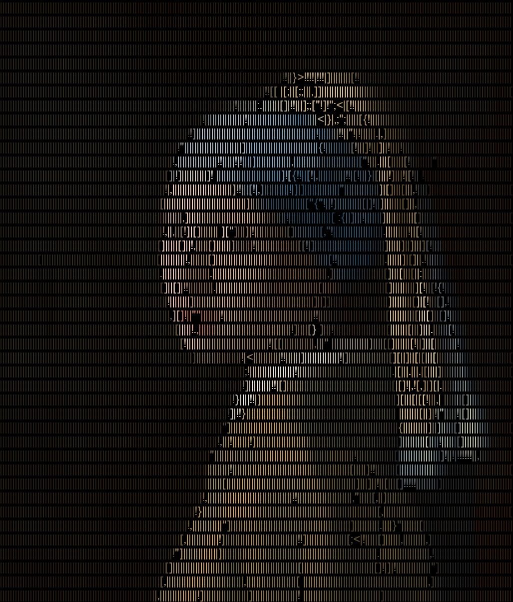
    </td>
  </tr>
</table>

```commandline
python contour.py ^
--image_path ../../resource/imgs/girl_with_pearl_earring.jpg ^
--canny1_min 160 --canny1_max 201 --canny1_step 20 ^
--canny2_min 240 --canny2_max 281 --canny2_step 20 ^
--dilate_iter 1 --erode_iter 0 --gb_sigmaX 0 --gb_size 5 ^
--contrast_factor 4 --contrast_window_size 8 ^
--invert_color
```

```commandline
python edge_trace.py ^
--image_path ./contour/contour_180_260.png ^
--resize_factor 2 ^
--palette_path ../../resource/palette_files/palette_chars_nonfix_arial_fast.json ^
--match_method slow ^
--original_image_path ../../resource/imgs/girl_with_pearl_earring.jpg ^
--antialiasing ^
--color_option original
```
