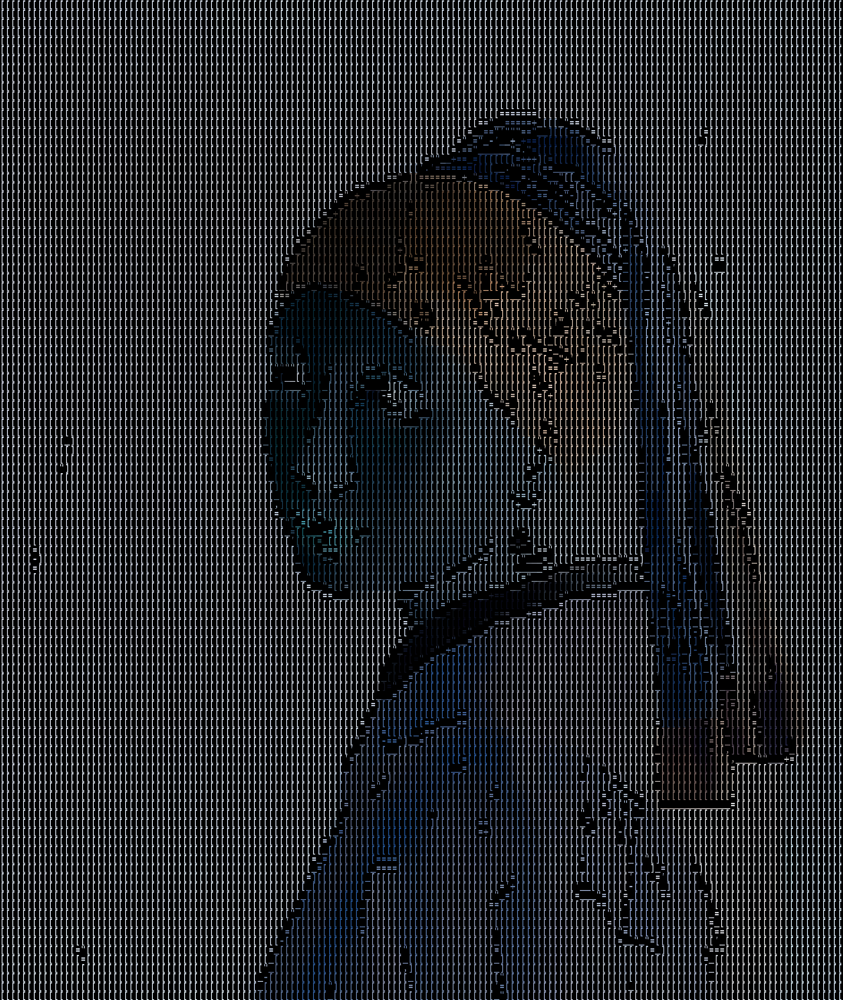

# Gallery (Trace ASCII Filter)

1️⃣ `cd` to `src/trace`.

---


```commandline
python contour.py ^
--image_path ../../resource/imgs/girl_with_pearl_earring.jpg ^
--canny1_min 0 --canny1_max 270 --canny1_step 20 ^
--canny2_min 0 --canny2_max 270 --canny2_step 20 ^
--dilate_iter 1 --erode_iter 0 --gb_sigmaX 0 --gb_size 5 ^
--contrast_factor 4 --contrast_window_size 8 ^
--invert_color
```

```commandline
python trace.py ^
--image_path ./contour/contour_180_260.png ^
--resize_factor 4 ^
--palette_path ../../resource/palette_files/palette_chars.json ^
--match_method slow ^
--color_option original ^
--original_image_path ../../resource/imgs/girl_with_pearl_earring.jpg
```

---



```commandline
python contour.py ^
--image_path ../../resource/imgs/girl_with_pearl_earring.jpg ^
--canny1_min 0 --canny1_max 270 --canny1_step 20 ^
--canny2_min 0 --canny2_max 270 --canny2_step 20 ^
--dilate_iter 1 --erode_iter 0 --gb_sigmaX 0 --gb_size 5 ^
--contrast_factor 4 --contrast_window_size 8 ^
--invert_color
```

```commandline
python trace.py ^
--image_path ./contour/contour_180_260.png ^
--resize_factor 4 ^
--palette_path ../../resource/palette_files/palette_chars.json ^
--match_method slow ^
--color_option original ^
--original_image_path ../../resource/imgs/girl_with_pearl_earring.jpg ^
--invert_color
```

---


```commandline
python contour.py ^
--image_path ../../resource/imgs/girl_with_pearl_earring.jpg ^
--canny1_min 0 --canny1_max 270 --canny1_step 20 ^
--canny2_min 0 --canny2_max 270 --canny2_step 20 ^
--dilate_iter 1 --erode_iter 0 --gb_sigmaX 0 --gb_size 5 ^
--contrast_factor 4 --contrast_window_size 8
```

```commandline
python trace.py ^
--image_path ./contour/contour_180_260.png ^
--resize_factor 4 ^
--palette_path ../../resource/palette_files/palette_chars.json ^
--match_method slow ^
--color_option original ^
--original_image_path ../../resource/imgs/girl_with_pearl_earring.jpg
```

---


```commandline
python contour.py ^
--image_path ../../resource/imgs/girl_with_pearl_earring.jpg ^
--canny1_min 0 --canny1_max 270 --canny1_step 20 ^
--canny2_min 0 --canny2_max 270 --canny2_step 20 ^
--dilate_iter 1 --erode_iter 0 --gb_sigmaX 0 --gb_size 5 ^
--contrast_factor 4 --contrast_window_size 8
```

```commandline
python trace.py ^
--image_path ./contour/contour_180_260.png ^
--resize_factor 4 ^
--palette_path ../../resource/palette_files/palette_chars.json ^
--match_method slow ^
--color_option original ^
--original_image_path ../../resource/imgs/girl_with_pearl_earring.jpg ^
--invert_color
```
